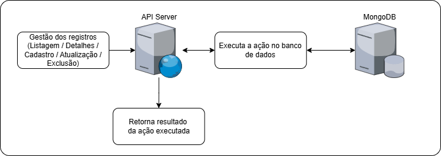
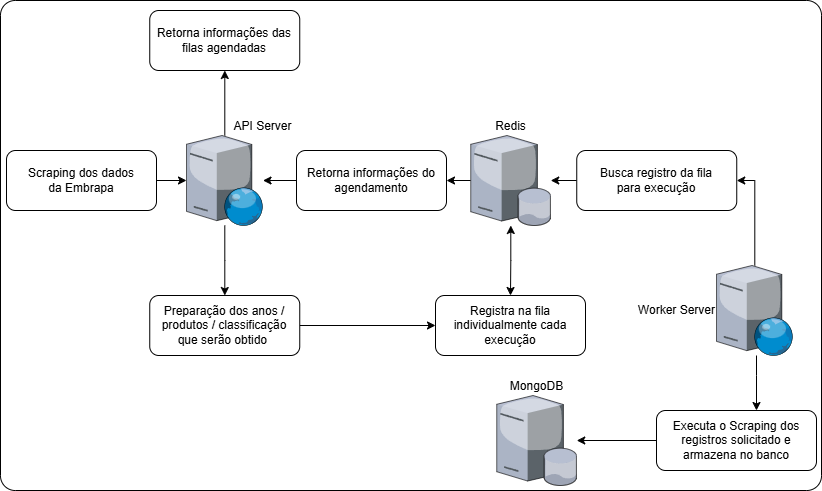

# Tech Challenge - FIAP - Machine Learning Engineer

Primeiro projeto da POS TECH FIAP - Machine Learning Engineer


## Detalhes do projeto

O projeto utiliza como padrão a porta 5000 para a execução. Após a execução do projeto, a URL base do projeto é [http://localhost:5000](http://localhost:5000) 

Na documentação do projeto é possível identificar todas as rotas das APIs. A documentação pode ser localizada em [http://localhost:5000/docs](http://localhost:5000/docs). 

O projeto contempla a criação das APIs para gestão de Produção, Processamento, Comercialização, Importação e Exportação contida no site da Embrapa, possibilitando listar, localizar, cadastrar, atualizar, excluir e realizar o scraping dos dados da Vitivinicultura da Embrapa.

## Inicialização do projeto

Para este projeto foi utilizado o Docker para criar a infra estrutura, criando 4 containers:
- Flask (python:3.12.2)
- Worker (python:3.12.2)
- Redis  (redis:alpine)
- MongoDB (mongo:8.0.9)

É necessário utilizar o Docker Compose para a execução local do projeto. Veja a [documentação](https://docs.docker.com/compose/) para saber mais sobre o Docker Compose.

As imagens dos containers de MongoDB e Redis foram endereçados diretamente no arquivo `docker-compose.yml`. Já os containers em Python, foram criados os arquivos especificos para o build do projeto, já realizando a instalação das dependências a partir do arquivo `code/requirements.txt`

É necessário construir os containers através do docker compose utilizando o comando abaixo:

```
$ docker compose build
```

Existem as variáveis de ambiente que devem ser incluídas no arquivo `code/.env`. Abaixo a lista de variáveis necessárias:

```
# Variaveis gerais da aplicação
FLASK_DEBUG= # True|False
FLASK_ENV= # development|production
SECRET_KEY= # Chave da aplicacao
SWAGGER_TITLE = 'Tech Challenge - FIAP V1'
EMBRAPA_URL = 'http://vitibrasil.cnpuv.embrapa.br/index.php'

# Variaveis da documentacao
SWAGGER_UI_VERSION = 3
API_VERSION = '0.0.1'
API_DESCRIPTION = 'API de analisar os dados de vitivinicultura da Embrapa'

# Variaveis dos bancos de dados
MONGODB_HOST = # Host do banco de dados. Para o ambiente local utilizar 'mongodb'
MONGODB_PORT = # Porta do banco de dados. Por padrao utilizar 27017
MONGODB_DATABASE = # Nome da base de dados
REDIS_URL = # Host do redis. Para ambiente local utilizar 'redis_queue'
```

Para a execução deve-se utilizar basta utilizar o comando abaixo:

```
$ docker compose up
```

## Arquitetura do projeto

O projeto foi estruturado com as camadas abaixo:

```
code/                  # Codigo do projeto
    | app/             # Arquivos da aplicacao
        | auth/        # Autenticacao das APIs
        | docs/        # Documentacao dos endpoints das APIs
        | enums/       # Tipos enumerados
        | exceptions/  # Excecoes customizadas
        | models/      # Estrutura dos dados para armazenamento no banco de dados
        | resources/   # Implementacao e regra de negocio das APIs
        | routes/      # Rota das APIs
        | tasks/       # Rotinas executadas assincronas
        | __init__py   # Arquivo de inicialicacao da aplicacao
        | config.py    # Inicialicacao das configuracoes e variaveis de ambiente
    | .env             # Variaveis de ambiente
    | main.py          # Arquivo principal de execucao da aplicacao
    | requirements.txt # Dependencias do projeto
docker-compose.yml     # Configuracoes do ambiente via Docker Compose
python_3.12.2          # Arquivo de construcao do ambiente python das APIs
python_worker_3.12.2   # Arquivo de construcao do ambiente python para as rotinas assincronas
```

Segue abaixo diagrama da arquitetura do projeto:


### Fluxo base da gestão dos dados (CRUD)



### Fluxo do scraping dos dados


